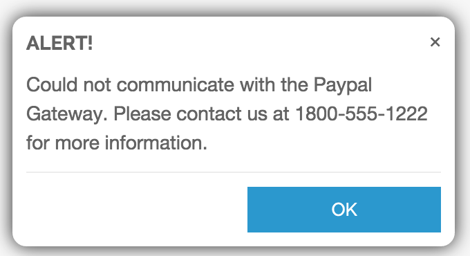
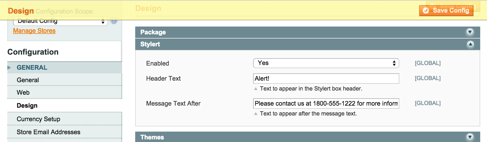

Stylert
=======
Customize the window alert box.

Description
-----------
Replaces the generic window alert box with a styleable modal. The generic alert 
box often appears on the one page checkout when the credit card number is invalid. 
This extension lets you style the box as well as configure the header and body
text. 

Installation Instructions
-------------------------
Upload files to root of your Magento install. Configure the extension in the 
admin in System -> Configuration -> General -> Design -> Stylert. Enable the 
extension and optionally set the header and message after text:

